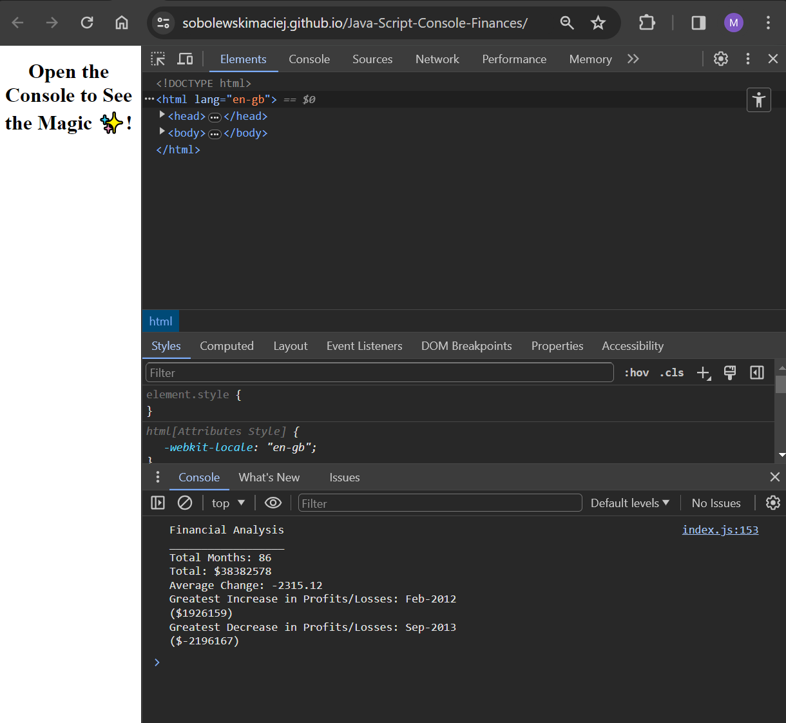

# Java-Script-Console-Finances

## Analyzing the financial records of a company

### The URL of the deployed console.log application.

[Console-Finances](https://github.com/SobolewskiMaciej/Java-Script-Console-Finances/deployments/github-pages)

### Screenshot of deployed console.log application.

Dataset provided by EdX Front end development bootcamp.

### Using the Console to See Results

 In most browsers, the console can be accessed by right-clicking on the web page, selecting "Inspect" or "Inspect Element," and then navigating to the "Console" tab.

